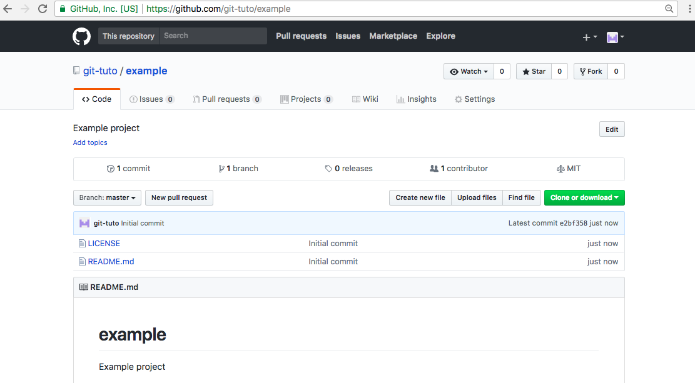

## Working with a Git project


GitHub allows you to modify and update your files directly on the GitHub website. But if you want a **better control** over your whole project, you can **work locally**, in your computer, in a Git project. These are the typical commands you need to work in a Git repository using the [Git client](git-client.md): 


### Clone a Git project

Using the [command line Git client](git-client.md) you can download a copy of your repository using the GitHub project url. Typically the clone URL follows this format:

```
https://github.com/your-user/your-project.git 
```

You can get the git project URL using the green button labeled "Clone or download"



The link shown is your Git clone URL. Copy this URL and execute the **clone** command:

```bash
git clone  https://github.com/your-user/your-project.git 
cd your-project/
```

The first command will download a copy (clone) of your repository and will **create a folder** with the same name of your folder. The second step is to enter to the newly created folder. 


### Pull external changes

Once you have cloned the project, and before you start a new group of changes, you may need to **pull** the remote repository (retrieving new changes made externally), to make sure you have the last version of the files.

```bash
git pull
```

If your project has *no external changes*, the output will be:

```
Already up-to-date.
```


### Status of your project

You can **check the status**s of your files (ok, modified, added, removed) using the status command:

```bash
git status
```

If your repository has **no local modifications**, you will receive a *"Nothing to commit"* message:


```console
On branch master
Your branch is up-to-date with 'origin/master'.

nothing to commit, working tree clean
```

If you have **modified**, **added** or **deleted** some files, you will receive a message showing files :

```console
On branch master
Your branch is up-to-date with 'origin/master'.

Changes not staged for commit:
  (use "git add <file>..." to update what will be committed)
  (use "git checkout -- <file>..." to discard changes in working directory)

	modified:   docs/README.md

Untracked files:
  (use "git add <file>..." to include in what will be committed)

	frontend/index.html

no changes added to commit (use "git add" and/or "git commit -a")
```

The output (in red color) suggests you have 1 modified file (*Not staged*) `docs/README.md` and 1 new file (*Untracked*) `frontend/index.html`. Then, if you want to add these files changes to your project, you need to add both files [using the `git add` command](#add-files-to-your-project). 

After you add all suggested files to your git project, you can run again the git status command:

```
On branch master
Your branch is up-to-date with 'origin/master'.

Changes to be committed:
  (use "git reset HEAD <file>..." to unstage)

	modified:   docs/README.md
	new file:   index.html
```

Now your files has been listed in the "*Changes to be commited*" section of the git status (in green color). These files are ready to [commit](#commit-your-changes).


### Add files to your project

After you create or modify files in your local repository, you can add these files to your git project using the `git add` command. You can specify more than one file and use wildcards (*) to add several files.

```bash
#add one file
git add path/to/file.ext

#add multiple files
git add path/to/file.ext /path/to/file2.ext

#add using wildcards (all .html files in web folder)
git add web/*.html

```

If you want to **add all files modified or added** without specifying each file listed in the git status output, you can execute using the `-A` (`--all`) argument

```bash
# add all files modified or recently added
git add -A

# same result
git add --all

``` 

If you added correctly your files to the git repository, when you execute the `git status` command, you receive the *"Nothing to commit"* message.

### Remove files from your project

If you need to remove files from your project, is not enough to delete the file from your directory. You need to remove the file from the git project using the `git rm` command. As well as the `git add` command, you can specify multiple files.

```bash
# remove one file
git rm path/to/deleted/file.tmp

# remove multiple files
git rm logs/app.log tmp/output.txt

#remove multiple files using wildcard (all .log files in logs/ and all files in cache/ folder )
git rm logs/*.log cache/*
```


### Commit your changes

Before you commit your files, you need to check the status of your files, and if something has not been added (files in red). If everything looks ok, then you can commit your changes using the **commit** command:

```bash
git commit -m "Message to be recorded in your transaction".
```

Also, there is a shortcut to automatically **add files and commit at the same time** using the `-A` option . 

```bash
# command-by-command 
git add -A
git commit -m "Adding new site images"

# same action with only one command
git commit -A -m "Adding new site images"
```

At this point, your changes has been commited only locallly. To [submit your modifications o your GitHub project](#submit-changes-to-your-github-project) you must `push` them. 


### Submit changes to your GitHub project

Where you are ready making changes to your project, modifying files and adding new features, the last step is to "push" your project modifications to update with the main repository in GitHub.

```bash
git push
```


### Push your commits to GitHub


