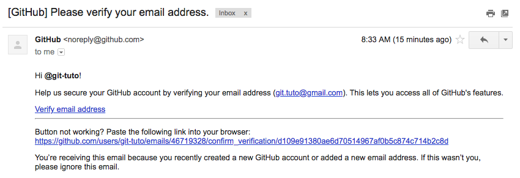
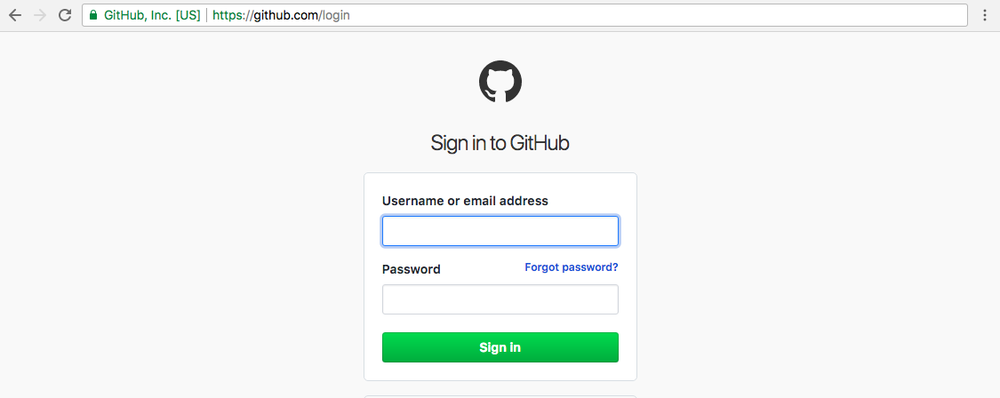
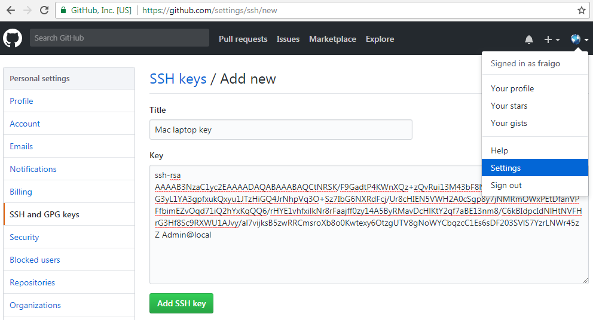

   
## GitHub Account
   
   
### Create a GitHub Account

Go to https://github.com/ and create an account. You need an **username** , an **email**, and a **password**  *(Use at least one letter [a-z], one numeral [0-9], and a minimum of seven characters for your password)*.


In the next step, you can choose a personal **free plan** for **unlimited public repositories**. If you plan to host **private projects**, you may choose a paid plan for US$7/month. Also, you can set up an **organization**, to manage multiple users and permissions. 

Finally, in the last step, you can answer some questions (optionally) to **tailor your experience** to optimize your account to your needs. At this point, your account was created successfully.


You will receive an **email of confirmation**. Go to the "**Verify Email Address**" link provided to confirm your account.




### Login into your account

Go to https://github.com/ and click on the "Sign In" menu to get the [**Login**](https://github.com/login) page (https://github.com/login).
   



Use your email and password to enter in your GitHub account.


### Configuring your account

You can do some configurations before using your account. Go to the right-top menu with an icon, and select [**Settings**](https://github.com/settings) (https://github.com/settings)


Some basic configurations you may want to change or update:

1. Your **profile image**, pressing the "**Upload new picture**" button.
2. **Additional info** from your profile (public email, biography, and others).
3. **SSH Keys** to access your repository from a Git Client.


### Register a SSH key in GitHub

To add security to your projects, you can add specific computers you want to access and modify your repositories. You need to add a SSH public key obtained from your local computer. See the section about gettng a SSH key to register in GitHub.

Once you have created a ssk key, you need to copy the contents of the `id_rsa.pub` file, which is inside the `.ssh` folder in your home directory. Then, you will go to the Account Settings, in the top-right menu. Then, go to the "SSH and GPG keys" in the left side. Add a description and the new key using the whole content of your `id_isa.pub` file wich has the following format:

```
ssh-rsa AAAAB3NzaC1yc2EAAA4DAQABAAABAQCtNRSK/F9GadtP4KWnXQz+zQvRui23M43bF8l9iZSYSho+ZOUzF3xcXPkDG3yL1YA3gpfxukQxyu1JTzHiGQ4JrNhpVq3O+Sz7IbG6NXRdFcj/Ur8cHIEN5VWH2A0cSgp8y7jNMRmOWxPEtDfanVPFfbimEZvOqd71iQ2hYxKqQQ6/rHYE1vhfxilkNr8rFaajff0zy14A5ByRMavDcHlKtY2qf7aBE13nm8/C6kBIdpcIdNlHtNVFHrG3Hf8Sc9RXWU1AJvy/al7vijksB5zwRRCmsroXb8o0Kwtexy6OtzgUTV8gNoWYCbqzcC1Es6sDF403SVlS7YzrLNWr45zZ User@computer
``` 




