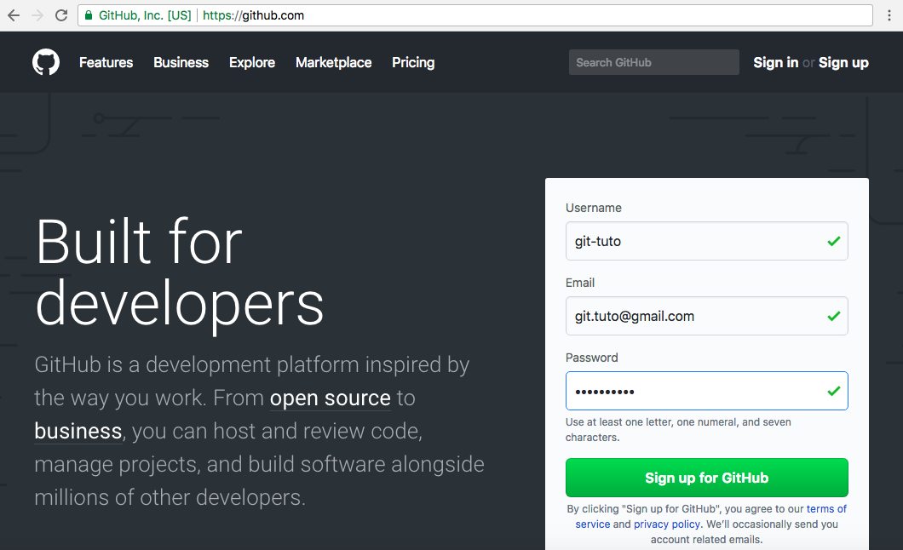
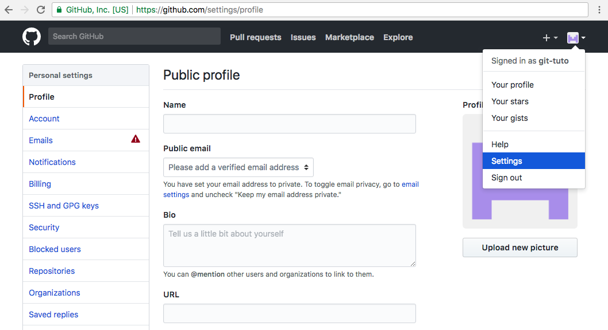

   
## GitHub Account
   
   
### Create a GitHub Account

Go to https://github.com/ and create an account. You need an **username** , an **email**, and a **password**  *(Use at least one letter [a-z], one numeral [0-9], and a minimum of seven characters for your password)*.

In the next step, you can choose a personal **free plan** for **unlimited public repositories**. If you plan to host **private projects**, you may choose a paid plan for US$7/month. Also, you can set up an **organization**, to manage multiple users and permissions. 

Finally, in the last step, you can answer some questions (optionally) to **tailor your experience** to optimize your account to your needs. At this point, your account was created successfully.

You will receive an **email of confirmation**. Go to the "**Verify Email Address**" link provided to confirm your account.

   

   
### Configuring your account

You can do some configurations before using your account. Go to the right-top menu with an icon, and select "**Settings**"

Some basic configurations you may want to change or update:

1. Your **profile image**, pressing the "**Upload new picture**" button.
2. **Additional info** from your profile (public email, biography, and others).
3. **SSH Keys** to access your repository from a Git Client.

