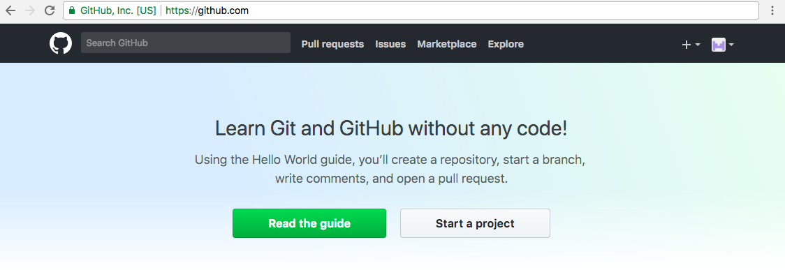
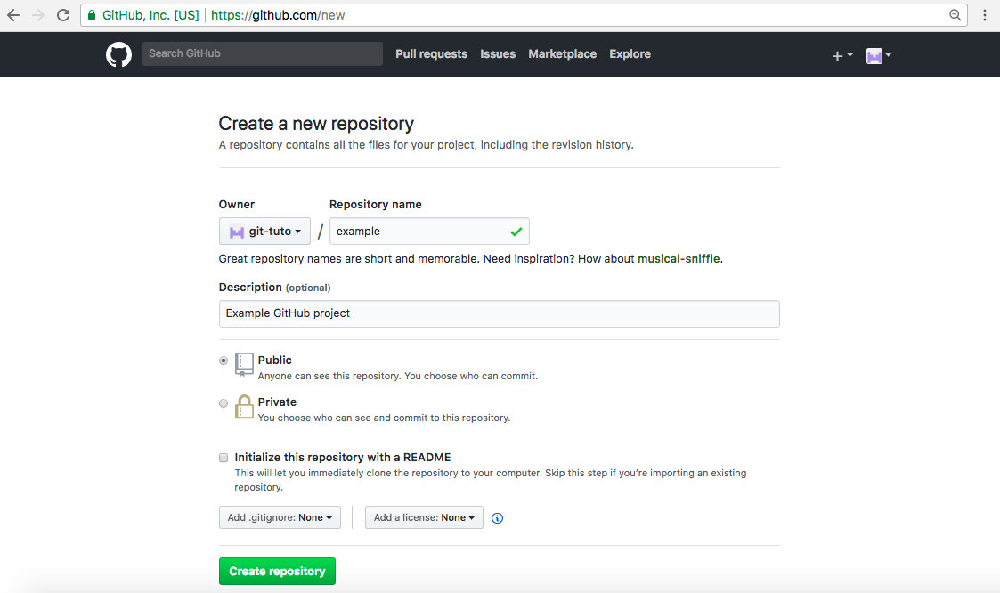
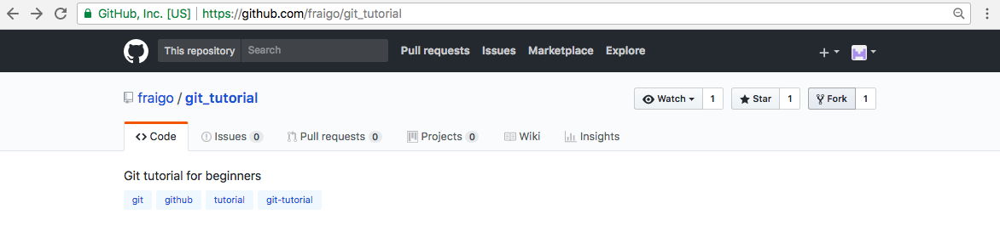
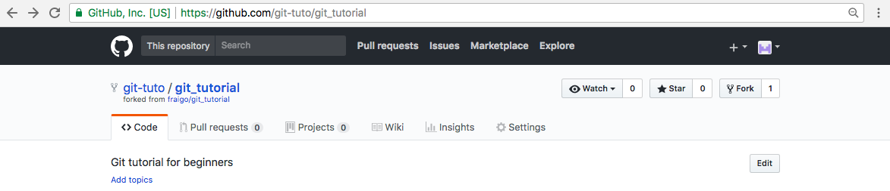

   
## GitHub Projects
   
### Create a GitHub project

First, [login into your account](github-account.md#login-into-your-account). If it's your **first time** creating a project, you receive a Welcome screen with buttons to **Read de guide**, and to **Start a new project**. 

If you press **Start a project**, you will be redirected to the [**Project creation**](https://github.com/new) page (https://github.com/new) to create a new *repository*.

In this page you can input the project information and initial configuration:

1. **Name** of the repository : A unique name using letters, numbers and hypens (-). Any special character in the name will be converted to hypen (`cool&fresh` will be `cool-fresh`).

2. Optional **description** : A long text to explain the purpose of your project.

3. **Public or private**: By default, your project is **public**. If you need a private project you need to consider to **Upgrade your account** (paying $7/month for unlimited private projects)

4. Initialize with **README**: Your project will start with a file named `README.md`, containing content to display when someone open your project page (https://github.com/your-user/your-project). Then, you can modify this file to add some extra information.

5. Add **.gitignore** : This is a special file with **rules** about *which files will be ignored* in your project (temporary files, backups, logs, special folders) when you are trying to **add new files** to the project. It's not necessary for a simple project, but you can choose a predefined file for specific types of projects (Java, Node, Laravel, etc)  

6. Add a **License**: If you plan to share your project with the community, you need to specify a type of License. For example, you can choose a "**MIT**" license to be less restrictive. You can get more information about licenses in http://choosealicense.com/

Once you have created the repository, you will be pointed to the project home page (https://github.com/your-user/your-project).

If you have selected to create a README file, a `README.md` file will appear in your repository.  The same if you have selected to add a License (file named `LICENSE`) or a `.gitignore`, these files will appear in your repository.  

### Fork a GitHub project

If you want to start a project based on an external GitHub project, you can **Fork It**. This operation will create **a copy of the original project** (current snapshot). Now you can modify this copy of the project. 

Then, if you have made significant changes to contribute, you can do a **Merge request** to send your changes for approval to the original repository owner.

For example, go to the [Git Tutorial project](https://github.com/fraigo/git_tutorial)  (https://github.com/fraigo/git_tutorial) and [fork it](https://github.com/fraigo/git_tutorial/fork) using the "Fork" button at the top-right corner.

When the fork is completed, you will be pointed to the *forked project*. Note that the **name** of the project will be the same, but now is under your user account (`fraigo/git_tutorial` forked to `your-user/git_tutorial`). 

### Configure your GitHub project

Once you are in a GitHub project [created by yourself](#create-a-git-hub-project), or a [forked project](#fork-a-git-hub-project), you can do some basic configurations:

1. Change the project **description**: Pressing the "Edit" button near the description header of the project, you can change the **Project description** and website.

2. Add or edit **topics** : Pressing "Add topics" (or "Manage topics" if there are existing topics) under the project description, you can add several project topics. Topics are **relevant tags** associated to your project. You can add some topics to tell the users what topics are covered in your project (For example: Java, Node)

3.  
